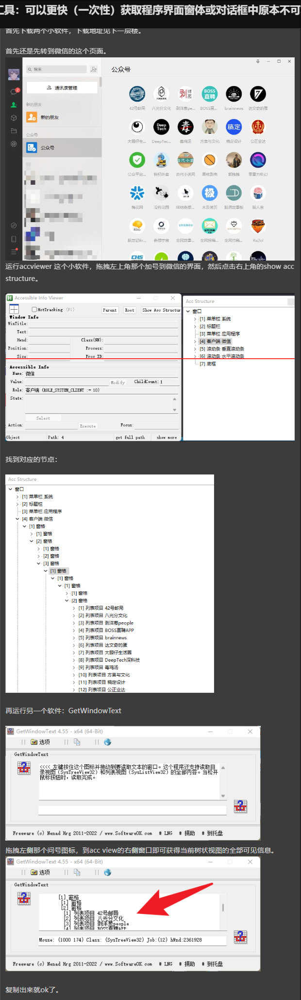

# WHY THIS ARTICLE?   
随着微信内容生态的丰富和日常使用时长的增加，公众号已经成为重要、优质的信息来源之一。当我们关注的公众号`越来越多`时，可能会希望能够`提取、整合、分享`自己关注的公众号列表，形成清晰结构化的`知识源`。那有没有办法能够获取到关注公众号的名单呢？

于是有了以下的尝试，可以在PC端用`“脚本读取+大模型”`的方法

--- 
## 1. 如何导出关注的微信公众号名单？
**方法1**：数量不多，截图就能搞定的情况，可以直接用微信自带的OCR（快捷键Alt+A）识图-提取文本。


**方法2**： 使用UIA自动化测试工具提取文本

使用工具：accviewer+GetWindowText

参考链接：
- [如何导出关注的微信公众号名单？](https://meta.appinn.net/t/topic/39590/7)
- [有没有更效率的工具：可以更快（一次性）获取程序界面窗体或对话框中原本不可复制的文本，非OCR模式](https://meta.appinn.net/t/topic/57763)




当我们拿到文本后，可能会发现带有一堆不想要的"编号和列表项目"，可以直接让ChatGPT帮我们提取公众号名称。


```markdown
帮我按条件提取对象文本，格式：列表项目 提取对象，输出：提取对象

[1] 列表项目 199IT互联网数据中心
[2] 列表项目 36氪
[3] 列表项目 36氪Auto
[4] 列表项目 阿坝旅游网
[5] 列表项目 adidas
[6] 列表项目 AI绘画师日记
[7] 列表项目 AI Interface
[8] 列表项目 AlibabaDesign
[9] 列表项目 廣告狂人
...
```

这样就能轻松将关注的公众号进行快速分类去分享啦~


